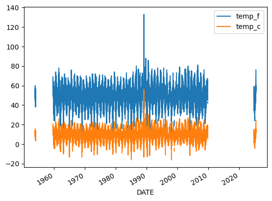
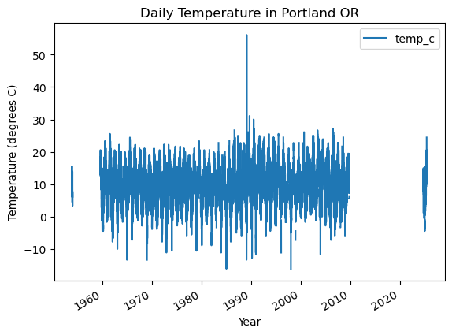
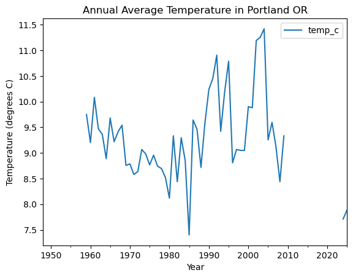
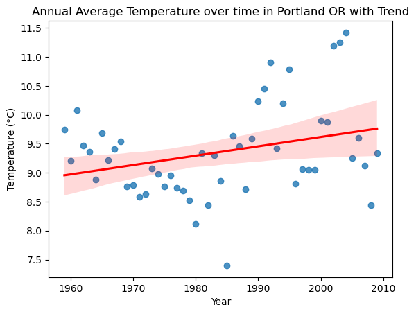

    'https://www.ncei.noaa.gov/access/services/data/v1?dataset=daily-summaries&dataTypes=TOBS&stations=USC00358634&startDate=1948-01-01&endDate=2025-09-21&units=standard'

<table border="1" class="dataframe">
  <thead>
    <tr style="text-align: right;">
      <th></th>
      <th>STATION</th>
      <th>TOBS</th>
    </tr>
    <tr>
      <th>DATE</th>
      <th></th>
      <th></th>
    </tr>
  </thead>
  <tbody>
    <tr>
      <th>1948-01-01</th>
      <td>USC00358634</td>
      <td>NaN</td>
    </tr>
    <tr>
      <th>1948-01-02</th>
      <td>USC00358634</td>
      <td>NaN</td>
    </tr>
    <tr>
      <th>1948-01-03</th>
      <td>USC00358634</td>
      <td>NaN</td>
    </tr>
    <tr>
      <th>1948-01-04</th>
      <td>USC00358634</td>
      <td>NaN</td>
    </tr>
    <tr>
      <th>1948-01-05</th>
      <td>USC00358634</td>
      <td>NaN</td>
    </tr>
  </tbody>
</table>

<table border="1" class="dataframe">
  <thead>
    <tr style="text-align: right;">
      <th></th>
      <th>STATION</th>
      <th>TOBS</th>
    </tr>
    <tr>
      <th>DATE</th>
      <th></th>
      <th></th>
    </tr>
  </thead>
  <tbody>
    <tr>
      <th>1948-01-01</th>
      <td>USC00358634</td>
      <td>NaN</td>
    </tr>
    <tr>
      <th>1948-01-02</th>
      <td>USC00358634</td>
      <td>NaN</td>
    </tr>
    <tr>
      <th>1948-01-03</th>
      <td>USC00358634</td>
      <td>NaN</td>
    </tr>
    <tr>
      <th>1948-01-04</th>
      <td>USC00358634</td>
      <td>NaN</td>
    </tr>
    <tr>
      <th>1948-01-05</th>
      <td>USC00358634</td>
      <td>NaN</td>
    </tr>
    <tr>
      <th>...</th>
      <td>...</td>
      <td>...</td>
    </tr>
    <tr>
      <th>2025-09-13</th>
      <td>USC00358634</td>
      <td>NaN</td>
    </tr>
    <tr>
      <th>2025-09-14</th>
      <td>USC00358634</td>
      <td>NaN</td>
    </tr>
    <tr>
      <th>2025-09-15</th>
      <td>USC00358634</td>
      <td>NaN</td>
    </tr>
    <tr>
      <th>2025-09-16</th>
      <td>USC00358634</td>
      <td>NaN</td>
    </tr>
    <tr>
      <th>2025-09-17</th>
      <td>USC00358634</td>
      <td>NaN</td>
    </tr>
  </tbody>
</table>

25865 rows × 2 columns

    <Axes: ylabel='Frequency'>

    

    

<table border="1" class="dataframe">
  <thead>
    <tr style="text-align: right;">
      <th></th>
      <th>TOBS</th>
    </tr>
    <tr>
      <th>DATE</th>
      <th></th>
    </tr>
  </thead>
  <tbody>
    <tr>
      <th>1948-01-01</th>
      <td>NaN</td>
    </tr>
    <tr>
      <th>1948-01-02</th>
      <td>NaN</td>
    </tr>
    <tr>
      <th>1948-01-03</th>
      <td>NaN</td>
    </tr>
    <tr>
      <th>1948-01-04</th>
      <td>NaN</td>
    </tr>
    <tr>
      <th>1948-01-05</th>
      <td>NaN</td>
    </tr>
    <tr>
      <th>...</th>
      <td>...</td>
    </tr>
    <tr>
      <th>2025-09-13</th>
      <td>NaN</td>
    </tr>
    <tr>
      <th>2025-09-14</th>
      <td>NaN</td>
    </tr>
    <tr>
      <th>2025-09-15</th>
      <td>NaN</td>
    </tr>
    <tr>
      <th>2025-09-16</th>
      <td>NaN</td>
    </tr>
    <tr>
      <th>2025-09-17</th>
      <td>NaN</td>
    </tr>
  </tbody>
</table>

25865 rows × 1 columns

<table border="1" class="dataframe">
  <thead>
    <tr style="text-align: right;">
      <th></th>
      <th>temp_f</th>
    </tr>
    <tr>
      <th>DATE</th>
      <th></th>
    </tr>
  </thead>
  <tbody>
    <tr>
      <th>1948-01-01</th>
      <td>NaN</td>
    </tr>
    <tr>
      <th>1948-01-02</th>
      <td>NaN</td>
    </tr>
    <tr>
      <th>1948-01-03</th>
      <td>NaN</td>
    </tr>
    <tr>
      <th>1948-01-04</th>
      <td>NaN</td>
    </tr>
    <tr>
      <th>1948-01-05</th>
      <td>NaN</td>
    </tr>
    <tr>
      <th>...</th>
      <td>...</td>
    </tr>
    <tr>
      <th>2025-09-13</th>
      <td>NaN</td>
    </tr>
    <tr>
      <th>2025-09-14</th>
      <td>NaN</td>
    </tr>
    <tr>
      <th>2025-09-15</th>
      <td>NaN</td>
    </tr>
    <tr>
      <th>2025-09-16</th>
      <td>NaN</td>
    </tr>
    <tr>
      <th>2025-09-17</th>
      <td>NaN</td>
    </tr>
  </tbody>
</table>

25865 rows × 1 columns

<table border="1" class="dataframe">
  <thead>
    <tr style="text-align: right;">
      <th></th>
      <th>temp_f</th>
      <th>temp_c</th>
    </tr>
    <tr>
      <th>DATE</th>
      <th></th>
      <th></th>
    </tr>
  </thead>
  <tbody>
    <tr>
      <th>1948-01-01</th>
      <td>NaN</td>
      <td>NaN</td>
    </tr>
    <tr>
      <th>1948-01-02</th>
      <td>NaN</td>
      <td>NaN</td>
    </tr>
    <tr>
      <th>1948-01-03</th>
      <td>NaN</td>
      <td>NaN</td>
    </tr>
    <tr>
      <th>1948-01-04</th>
      <td>NaN</td>
      <td>NaN</td>
    </tr>
    <tr>
      <th>1948-01-05</th>
      <td>NaN</td>
      <td>NaN</td>
    </tr>
    <tr>
      <th>...</th>
      <td>...</td>
      <td>...</td>
    </tr>
    <tr>
      <th>2025-09-13</th>
      <td>NaN</td>
      <td>NaN</td>
    </tr>
    <tr>
      <th>2025-09-14</th>
      <td>NaN</td>
      <td>NaN</td>
    </tr>
    <tr>
      <th>2025-09-15</th>
      <td>NaN</td>
      <td>NaN</td>
    </tr>
    <tr>
      <th>2025-09-16</th>
      <td>NaN</td>
      <td>NaN</td>
    </tr>
    <tr>
      <th>2025-09-17</th>
      <td>NaN</td>
      <td>NaN</td>
    </tr>
  </tbody>
</table>

25865 rows × 2 columns

    <Axes: xlabel='DATE'>

    

    

    <Axes: title={'center': 'Daily Temperature in Portland OR'}, xlabel='Year', ylabel='Temperature (degrees C)'>

    

    

<table border="1" class="dataframe">
  <thead>
    <tr style="text-align: right;">
      <th></th>
      <th>temp_f</th>
      <th>temp_c</th>
    </tr>
    <tr>
      <th>DATE</th>
      <th></th>
      <th></th>
    </tr>
  </thead>
  <tbody>
    <tr>
      <th>1948-12-31</th>
      <td>NaN</td>
      <td>NaN</td>
    </tr>
    <tr>
      <th>1949-12-31</th>
      <td>NaN</td>
      <td>NaN</td>
    </tr>
    <tr>
      <th>1950-12-31</th>
      <td>NaN</td>
      <td>NaN</td>
    </tr>
    <tr>
      <th>1951-12-31</th>
      <td>NaN</td>
      <td>NaN</td>
    </tr>
    <tr>
      <th>1952-12-31</th>
      <td>NaN</td>
      <td>NaN</td>
    </tr>
    <tr>
      <th>...</th>
      <td>...</td>
      <td>...</td>
    </tr>
    <tr>
      <th>2021-12-31</th>
      <td>NaN</td>
      <td>NaN</td>
    </tr>
    <tr>
      <th>2022-12-31</th>
      <td>NaN</td>
      <td>NaN</td>
    </tr>
    <tr>
      <th>2023-12-31</th>
      <td>NaN</td>
      <td>NaN</td>
    </tr>
    <tr>
      <th>2024-12-31</th>
      <td>45.881356</td>
      <td>7.711864</td>
    </tr>
    <tr>
      <th>2025-12-31</th>
      <td>46.192982</td>
      <td>7.884990</td>
    </tr>
  </tbody>
</table>

78 rows × 2 columns

    <Axes: title={'center': 'Annual Average Temperature in Portland OR'}, xlabel='Year', ylabel='Temperature (degrees C)'>

    

    

  

  

    Slope (°C per year): 0.016131681212785833
    R²: 0.0880

    

    

### Portland Has Warmed ~0.16 °C per Decade Since 1958

A linear OLS regression shows an average warming rate of **0.016 °C per year** (≈ **0.16 °C per decade**). While the R² value is low (**0.088**), indicating that year-to-year variability is large, the overall trend suggests a gradual rise in Portland’s annual average temperature since the mid-20th century.
